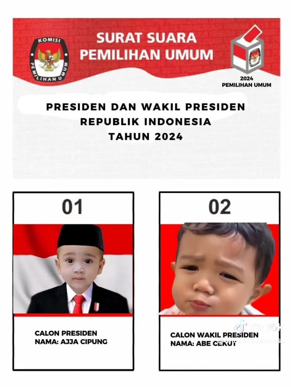

# much25.github.io
<!DOCTYPE html>
<html lang="en">
<head>
  <meta charset="UTF-8">
  <meta name="viewport" content="width=device-width, initial-scale=1.0">
  <title>Profil - Muchdor Bafaqih</title>
  <!-- Bootstrap CSS -->
  <link href="https://cdn.jsdelivr.net/npm/bootstrap@5.3.0-alpha1/dist/css/bootstrap.min.css" rel="stylesheet">
  <link href="https://cdnjs.cloudflare.com/ajax/libs/font-awesome/5.15.4/css/all.min.css" rel="stylesheet">

  <!-- Custom CSS -->
  
  
</head>

<body>

  <!-- Navbar -->
  <nav class="navbar navbar-expand-lg navbar-dark bg-dark">
    

      <a class="navbar-brand" href="#">Profil</a>
      <button class="navbar-toggler" type="button" data-bs-toggle="collapse" data-bs-target="#navbarNav" aria-controls="navbarNav" aria-expanded="false" aria-label="Toggle navigation">
        
      </button>
      

        <ul class="navbar-nav ms-auto">
          <li class="nav-item">
            <a class="nav-link" href="#home">Beranda</a>
          </li>
          <li class="nav-item">
            <a class="nav-link" href="#about">Profil</a>
          </li>
          <li class="nav-item">
            <a class="nav-link" href="#experience">Pengalaman</a>
          </li>
          <li class="nav-item">
            <a class="nav-link" href="#education">Pendidikan</a>
          </li>
          <li class="nav-item">
            <a class="nav-link" href="#contact">Kontak</a>
          </li>
        </ul>
      

    

  </nav>

  <!-- Home Section -->
  <section id="home" class="py-5" style="background-image: url('keren.avif');">
    

      <h1 style="color: white;">Selamat Datang di Profil Saya</h1>

        <!-- Add content here -->
    

</section>

  </section>

  <!-- About Section -->
  <section id="about" class="py-5">
    

      <h2>Tentang Saya</h2>
      

        

          
          
        

        

          

            Nama saya Muchdor Bafaqih. Saya lahir di Jombang pada 25 Mei 2004. Saat ini, saya sedang menempuh kuliah di Universitas Hasyim Asy'ari dengan fokus pada keahlian dalam coding. Saya memiliki minat yang besar dalam bidang pengembangan perangkat lunak dan senang mempelajari hal-hal baru seputar teknologi. Selain itu, saya aktif mengikuti berbagai
             kursus online untuk meningkatkan keterampilan saya dalam pemrograman dan pengembangan web.

        

      

    

  </section>

  <!-- Experience Section -->
  <section id="experience" class="py-5">
    

      <h2>Pengalaman</h2>
      
software engineer

    

  </section>

  <!-- Education Section -->
  <section id="education" class="py-5">
    

      <h2>Pendidikan</h2>
      
Universitas Hasyim Asy'ari
        Bachelor of Science in Computer Science
    

    

  </section>

  <!-- Contact Section -->
  <section id="contact" class="py-5">
    

        <h2>Kontak</h2>
        

            <i class="fab fa-whatsapp contact-icon"></i>
            <a href="https://wa.me/6285812016289" target="_blank">WhatsApp</a>
        

        

            <i class="fab fa-instagram contact-icon"></i>
            <a href="https://www.instagram.com/muchdorbfq/" target="_blank">Instagram</a>
        

        

            <i class="fab fa-tiktok contact-icon"></i>
            <a href="https://www.tiktok.com/@zeeta000" target="_blank">TikTok</a>
        

        

            <i class="far fa-envelope contact-icon"></i>
            <a href="mailto:muchdorbfq@gmail.com">muchdorbfq@gmail.com</a>
        

    

</section>

</section>

  <!-- Bootstrap Bundle with Popper -->
  
</body>
</html>
